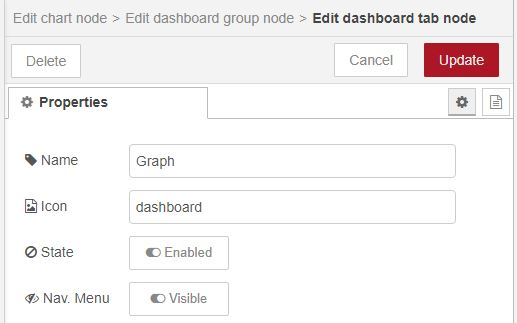

# Introduction

The present task's main objective is to develop and test an *MQTT Broker* based on the MQTT (Mosquitto) protocol. 

Thus, the student must run the Mosquitto service in the BeagleBone to create the Broker. Then, an ESP32 client must publish the temperature data logged by a sensor. Furthermore, the Node-RED App should be used as a client to show the data as a Graphical User Interface from the ESP32 client. 

Finally, the student must implement a basic **Alarm** indicator that turns ON when the temperature exceeds a limit value or remains OFF if the value is lower.


# Technical Report (Readme file)

The students must consider presenting a detailed document that includes:

- MQTT Broker installation and configuration 
- ESP32 client connection (schematics) and programming code with detailed explanation
- Node-RED installation, configuration, and views

# MQTT SERVER 

## Mosquitto Installation

It is necesary to update and upgrade the actual system using these commands in the terminal:

```
sudo apt udate
sudo apt upgrate
```

Then we have to install Mosquitto

```
sudo apt install mosquitto
```

To know if the moquitto service is working, type the next command:

```
sudo systemctl status mosquitto.service
```

If the status is disabled, then type

```
sudo systemctl enable mosquitto.service
```

Then, as you can see in the next image, now if type the status command, we can see the service is enabled


## Configuration

To modificate the configuration of mosquitto, it is necessary to replace the default configuration file that is in this repository:

```
sudo cp ./mosquitto.conf /etc/mosquitto/mosquitto.conf
```

Then, create a password file instanced on the mosquitto.conf file with

```
sudo touch /etc/mosquitto/passwd
```

And finally, restart the mosquitto service

```
sudo systemctl restart mosquitto
```

## Node-REd Installation

In the terminal type

```
sudo apt install nodejs
sudo apt install npm
```

Now using the npm (Node Package Manager), install the Node-red app and the Dashboard

```
npm install node-red
npm install node-red-dashboard
```

Finally, run the app in the background and verify if node-red is runnig

```
node-red &
sudo netstat -plnt
```

To access to Node-red, go to your browser and type your localhost name with the extention ":1880", example:

```
beaglebone.local:1880
```

## MQTT Test

Now, to see if it is working correctly is necessary to download `MQTTX` in your PC. Create a new conection by clicking in the plus symbol on the top-left part of the app. Then fill with the next information.


I have already that name, so in my case, it shall not be created.

Go to the local host of the beaglebone: `beaglebone.local:1880`, then in the new interface go to the left part and find the next components by adding them to the central panel: 
`mqtt in` in "network"
`debug` in "commun"
`chart` in dashboard


Double click in mqtt (pink) and fill with the next information. To change the server go to the next step.


Now click in the pencil next to the server. Type the I.P. of the beagle (in this case 192.168.7.2), with the port 1883 and change the protocol to `MQTT V3.1.1`, press the red button `Update` and `Done`.


Now doble click in chart (blue), go directly to the pencil next to Group. Then, again to the pencil next to Tab, give it a name (I'll use Graph), finally press the buttons `Update` and `Done`




Go to the app in the PC, connect the server of mosquitto (green button). In the local host of the browser click on the red button on the top-right side `Deploy`.


Make sure the topic of the server is the same as the Node-Red net. In this case the topic is `test.`


# Temperatu and Humidity Sensor

The sensor that is gonna be used is the Dht11, if you watch it from the front of the component, the connections are GND, Data and VCC

`VCC` is the voltage supply (3.3V)
`Data` is the measure pin.
`GND` is the ground connection.


## Connections

It is necessary to put a 10k Ohms resistor with a pull up configuration. Follow the next image.


## Programming

Download Arduino in your PC, then open the app, go to `Archive -> Preferences`, in the URL Manager put the next direction: 
`https://dl.espressif.com/dl/package_esp32_index.json`
Then, click on `Ok`.


Go to `Tools -> Plates -> Pkate Manager` and in Search type `esp32`, and look for the one that was made by Espressif Systems.

You must add 3 libreries so the Dht11 and the connection to the Mosquitto Server could work properly.
Go to `Program -> Add Libraries -> Manage Libraries` and type in Search:
`PubSubClient` by Nick O'Leary
`DHT sensor library` by Adafruit
`Adafruit Unifed Sensor` by Adafruit


Use the code of `dht11-esp32.ino` to test the sensor. When you are gonna send the code to the esp32, it's going to look for comunication, so when it happens, make sure the next things in `Tools`:
Plate: `DOIT ESP32 DEVKIT V1`
Update speed: `921600`
Frequency: `80MHz`
The COM needs to be reviewed in the Device Manager o Administrator (in this case COM14).


Now if you open the Serial Monitor on the top-right side, you can see that the sensor is measuring every 3 seconds.


# Internet Connection (ESP32)

To connect the esp32 with the server of MQTT, go to the MQTTX app and create another connection, with the next parameters:
Name: `emqx`

Client: `Your_Computer`

Host: `mqtt://` `broker.emqx.io`

Port: `1883`

Username: `emqx`

Password: `public`

MQTT Version: `5.0`

Make sure the topic is the same as the one in the `mqtt-esp32.ino`, in this case esp32/test

Go to Arduino, use the same configuration as the one in the Sensor that was used before. Update and press `boot` unitl the connetion get completed.


# ESP32 + Mosquitto Server + Sensor

First go to the local host of Node-Red in `beaglebone.local:1880` in the browser. Add 2 of the next components to the central panel:
`mqtt in` in network.
`debug` in commun.
`chat` in dashboard.


One is gonna be used for the Temperature and the other fot the Humidity, so let's change their names and propierties.

For the temperature mqtt in:


For the humidity mqtt in:


Configuration of propierties:


On the charts just change the names (Labels) like the names of the measure.

Go to Arduino and use the code `dht11-mqtt-esp32.ino`, connect the sensor. Update the new code to the ESP32, don´t forget to press the button `boot` while it is updating.

In the connection of the MQTTX app, change the topic to the same name as the node-red net `temp/esp32`, and create another subscription with the other topic `hum/esp32`. Activate the connection.

Now in the Serial Monitor you should have a vew like this:


That means that the ESP32 was succesfully connected to Wi-Fi and it is measuring the temperatura and humidity.

Go again to the beaglebone local host in the browser, press the red button `Deploy` and open a new tab and type `ui`and the end of it (in this case `http://beaglebone.local:1880/ui`).

As you can see the measures of the ESP32 and the charts (Graphs) match each other.


